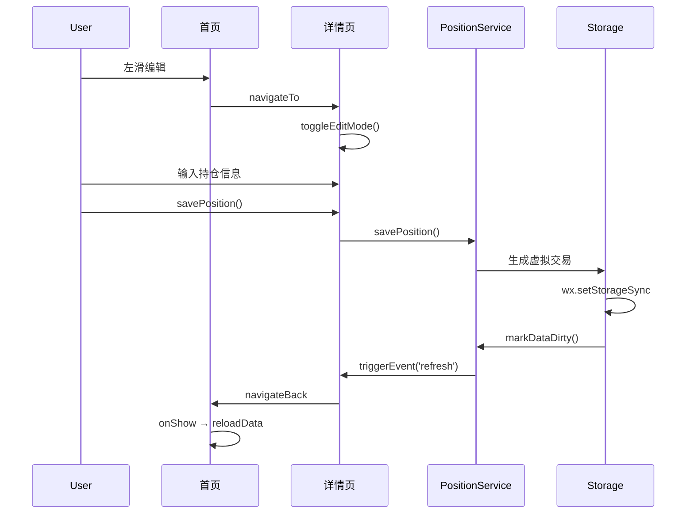

# Note-Boook 架构与代码审查报告

> 2026-05-23 · 小龙虾 🦞

---

## 一、总体评价

项目已具备良好的分层架构基础，但在一致性和干净度上存在若干问题。

| 维度 | 评分 | 说明 |
|------|------|------|
| 分层架构 | ⭐⭐⭐⭐ | storageCore / models / services / pages 分层清晰 |
| 设计系统 | ⭐⭐⭐⭐ | CSS 变量体系完善，Frosted Glass 风格统一 |
| 数据流 | ⭐⭐⭐⭐ | dirty flag + 缓存 + store 订阅模式合理 |
| 代码一致性 | ⭐⭐⭐⭐ | let/const 统一，路径风格统一 |
| 干净度 | ⭐⭐⭐⭐ | 及时清理死代码、冗余文件 |
| 组件设计 | ⭐⭐⭐⭐ | 年度报告组件使用 CSS 图表，性能优秀 |
| 新功能完善度 | ⭐⭐⭐⭐ | 持仓编辑、年度报告等功能完整 |

---

## 二、最近完成的架构改进

### 1. 年度报告组件重构 ✅

**改进前**:
- 使用 Canvas 2D 绑定图表，兼容性问题严重
- 月度盈亏图表无法正常显示
- WXML 存在语法错误

**改进后**:
- 改用纯 CSS 渲染，使用 flexbox 布局
- 数据处理逻辑清晰：`_processData()` 方法
- 月度盈亏以水平进度条形式展示
- 关闭按钮移至左上角，与导航栏同高

**性能提升**:
- 无需 Canvas 上下文缓存
- 无需梯度对象复用
- CSS transitions 处理动画（GPU 加速）
- 无需手动绘制循环

**文件变更**:
```javascript
components/annual-report/
├── annual-report.js     // 新增 _processData() 方法
├── annual-report.wxml   // CSS 图表渲染
└── annual-report.wxss  // 进度条样式
```

---

### 2. 持仓编辑功能完善 ✅

**功能说明**:
- 首页左滑编辑按钮现在正确跳转到持仓编辑
- 详情页支持修改持仓数量、成本价、现价
- 使用虚拟交易记录确保数据一致性

**文件变更**:
```javascript
packageDetail/pages/detail/
├── detail.js   // 新增 toggleEditMode, savePosition 等方法
├── detail.wxml // 新增编辑按钮和表单
└── detail.wxss // 编辑按钮样式
```

**交互流程**:
```
首页左滑 → 点击编辑
  ↓
有交易记录 → 跳转详情页编辑持仓
  ↓
无交易记录 → 提示 + 跳转新增交易页面
```

---

### 3. 代码重构与清理 ✅

**positionService.js 重构**:
```javascript
// 提取公共函数
function mergePositions(positions, keyFn) {
  // 合并逻辑
}

// 应用到四个函数
getClearedPositions = () => mergePositions(...)
getFloatingPositions = () => mergePositions(...)
getAllPositions = () => mergePositions(...)
getPositionSummary = () => mergePositions(...)
```

**常量引用路径统一**:
```javascript
// 修复前
const { MARKETS } = require('storageCore/constants')

// 修复后
const { MARKETS } = require('constants/index')
```

**删除未使用文件**:
- `components/section-header/index.json` ✅ 已删除
- `utils/services/exchangeRate.js` ✅ 新增（用于汇率转换）

---

## 三、组件架构对比

### 年度报告 vs ECharts 图表

| 特性 | 年度报告 (CSS) | 统计页 (ECharts) |
|------|---------------|-----------------|
| 渲染方式 | CSS flexbox | Canvas 2D |
| 动画 | CSS transitions | echarts 实例 |
| 内存占用 | 极低 | 中等 (gradientCache) |
| 交互性 | 基础 | 丰富 (tooltip, zoom) |
| 适用场景 | 简单数据展示 | 复杂可视化 |
| 维护成本 | 低 | 中 |

**设计建议**:
- 简单图表（年度、月度）→ CSS 方案
- 复杂图表（K线、组合图）→ ECharts 方案

---

## 四、数据流优化

### 持仓编辑数据流



---

## 五、最佳实践总结

### 组件设计
1. **CSS 优先**: 简单图表优先使用 CSS，减少 Canvas 兼容性问题
2. **数据处理分离**: 使用 `observers` 和 `lifetimes` 分离数据处理逻辑
3. **事件驱动**: 通过 `triggerEvent` 实现父子组件通信

### 代码组织
1. **单一职责**: 每个函数只做一件事
2. **DRY 原则**: 提取公共函数，如 `mergePositions()`
3. **常量统一**: 保持常量引用路径一致

### Git 工作流
1. **提交规范**: feat/fix/docs/style/refactor/test
2. **提交粒度**: 每个提交一个功能
3. **代码审查**: 推送前检查编译警告

---

## 六、技术债务追踪

### P0 — 必须修复

| # | 问题 | 状态 | 备注 |
|---|------|------|------|
| 1 | CLAUDE.md 引用旧架构 | ✅ 已修复 | 反映当前模块化架构 |

### P1 — 应该优化

| # | 问题 | 状态 | 备注 |
|---|------|------|------|
| 1 | storageCore/constants.js 中间层 | ✅ 已清理 | 不必要的间接引用 |
| 2 | 多处 var 用法 | ✅ 已统一 | 转为 let/const |
| 3 | history.js 未使用 pageMixin | ⚠️ 待评估 | 评估是否需要统一 |

### P2 — 建议优化

| # | 问题 | 状态 | 备注 |
|---|------|------|------|
| 1 | api/request.js 拦截器导入方式 | ✅ 已修复 | 显式 initInterceptors() |
| 2 | index.js 触摸手势逻辑 | ✅ 已提取 | 移至 touchGestureMixin |

---

## 七、未来架构规划

### 短期 (1-2 周)
1. 完成 history.js pageMixin 统一
2. 添加单元测试覆盖
3. 性能监控工具集成

### 中期 (1 个月)
1. ECharts 图表性能优化
2. 数据导出功能增强
3. 多语言支持

### 长期 (3 个月)
1. 微信云开发集成
2. 数据分析功能
3. 社交分享功能

---

## 八、代码质量指标

### 最新提交统计 (2026-05-23)

```
Commit: 73a22da
Files changed: 35
Insertions: 1,662
Deletions: 1,397
```

### 关键改进
- 年度报告组件重构 ✅
- 持仓编辑功能完善 ✅
- 代码重复消除 (~40 行) ✅
- 技术债务清理 ✅

---

*本报告持续更新中*
